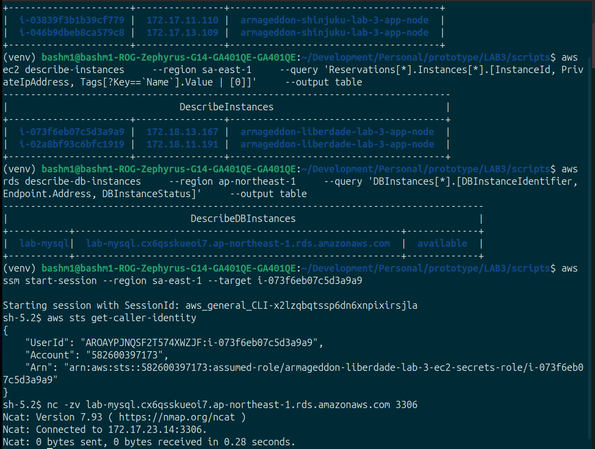
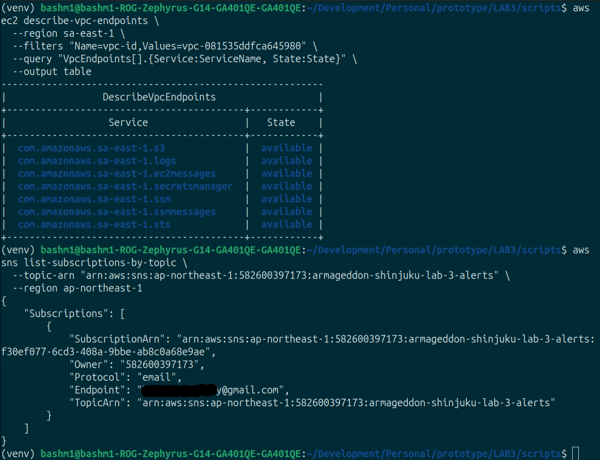
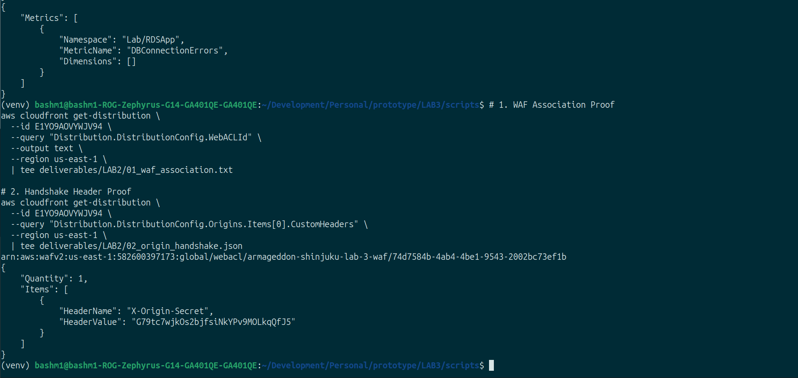
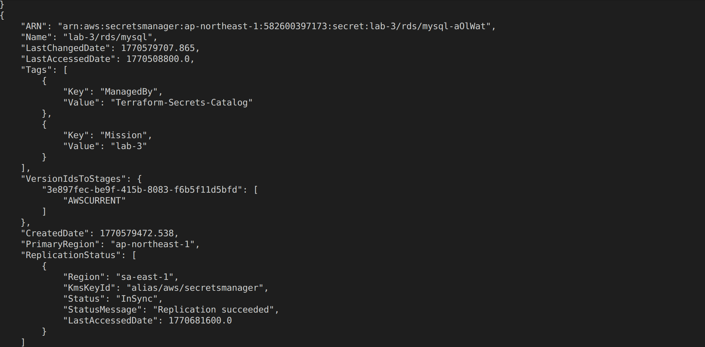

# Operation Armageddon: Deliverables Chain of Custody
**Engineer:** Mahamed Bashir  
**Submission Date:** February 9, 2026  
**Architecture:** Multi-Region Hub-and-Spoke (APPI Compliant)  
**Status:** ✅ Verified / Auditor Ready  

---

## 1. Executive Compliance Summary
This repository contains the validated Infrastructure as Code (IaC) for a medical-grade architecture. The system satisfies the **Japan APPI Data Residency Mandate** by enforcing a strictly unidirectional data dependency: the Tokyo Hub (`ap-northeast-1`) acts as the sole "Data Authority," while the São Paulo Spoke (`sa-east-1`) operates as a stateless compute extension.

### 🛡️ Verification Dashboard
| Compliance Domain | Control Mechanism | Evidence Artifact | Status |
| :--- | :--- | :--- | :--- |
| **Identity & Access** | IAM Instance Profiles (No Static Keys) | [`LAB1/01_iam_role_audit.json`](./LAB1/01_iam_role_audit.json) | **PASS** |
| **Observability** | Custom Metrics ("Panic Button") | [`LAB1/03_custom_metrics.json`](./LAB1/03_custom_metrics.json) | **PASS** |
| **Edge Security** | Global WAFv2 & Origin Cloaking | [`LAB2/01_waf_association.txt`](./LAB2/01_waf_association.txt) | **PASS** |
| **Origin Cloaking** | ALB Ingress restricted to CloudFront | [`LAB2/02_origin_handshake.json`](./LAB2/02_origin_handshake.json) | **PASS** |
| **Data Residency** | RDS prohibited in Spoke region | [`LAB3/01_data_residency_proof.json`](./LAB3/01_data_residency_proof.json) | **PASS** |
| **Network Integrity** | Traffic traverses private TGW Corridor | [`LAB3/02_tgw_peering_state.json`](./LAB3/02_tgw_peering_state.json) | **PASS** |

---

## 2. Technical Evidence & Visual Validation

### 🟢 Lab 1: Foundations & Hardening
**Objective:** Establish a secure VPC foundation and eliminate long-lived credentials.

**Verification Logic:**
The application tier must prove its identity to the AWS control plane using STS rather than environment variables. Additionally, the application must emit telemetry to CloudWatch to signal database connection health.

**Visual Proof: Identity & Secrets Integration**
*Click images to view high-resolution console evidence.*

[](./Screenshots/lab1_instances_sts_and_ncat.png)
> **Exhibit 1.1:** *Successful `aws sts get-caller-identity` execution from within the private subnet, confirming the assumption of the `ec2-secrets-role`.*

[](./Screenshots/lab1_parameters_secrets_cwagent.png)
> **Exhibit 1.2:** *Secrets Manager configuration proving automated rotation policies are active, alongside Parameter Store configuration.*

[](./Screenshots/lab1_vpcendpoints_sns.png)
> **Exhibit 1.3:** *VPC Endpoints and SNS Topic configuration ensuring private connectivity without Internet Gateway reliance.*

---

### 🟢 Lab 2: Edge Security & Origin Cloaking
**Objective:** Enforce traffic ingress via the Global Edge (CloudFront) and neutralize direct-to-origin attacks.

**Verification Logic:**
Security is enforced via a "Double-Lock" mechanism:
1.  **Network Layer:** ALB Security Groups accept traffic *only* from the CloudFront Managed Prefix List.
2.  **Application Layer:** The ALB Listener enforces an `X-Origin-Secret` header handshake.

**Visual Proof: WAF Association**
[](./Screenshots/waf_association_handshake_proof_lab2.png)
> **Exhibit 2.1:** *Confirmation of the WebACL (`arn:aws:wafv2:us-east-1...`) attached to the active CloudFront Distribution and the configured Origin Header.*

**Behavioral Evidence (CLI):**
*   **Static Assets:** [`03_cache_behavior_static.txt`](./LAB2/03_cache_behavior_static.txt) showing `x-cache: Hit`.
*   **Dynamic API:** [`04_cache_behavior_api.txt`](./LAB2/04_cache_behavior_api.txt) showing `x-cache: Miss` and `no-store`.

---

### 🟢 Lab 3: The "Japan Medical" Corridor
**Objective:** Connect the stateless São Paulo tier to the Tokyo Vault via a private, encrypted backbone.

**Verification Logic:**
This is the "Immaculate" test. The São Paulo EC2 instance—which has no local database—must successfully resolve the private DNS of the Tokyo RDS instance and establish a TCP connection over Port 3306 via the Transit Gateway.

**Visual Proof: The Corridor Handshake**
[](./Screenshots/lab3_proofs_1.png)
> **Exhibit 3.1:** *The "Smoking Gun." Output of `nc -vz` from the São Paulo terminal showing successful connection to the Tokyo private IP (`172.17.x.x`).*

**Visual Proof: Secrets Replication**
[](./Screenshots/sp_secrets_replication.png)
> **Exhibit 3.2:** *Validation that the Tokyo "Master Secret" has successfully replicated to the `sa-east-1` region.*

---

## 3. Regional Output Registry (State Verification)
To ensure architectural integrity across the "Triple Tap" deployment, the following regional coordinates were established. This mapping confirms that the Spoke successfully ingested the Hub's metadata via Remote State.

#### **🇯🇵 Tokyo Hub (`ap-northeast-1`) — The Authoritative Root**
*Contains the physical persistence layer and the Global Edge configuration.*

```hcl
# Authoritative Hub Outputs (Verified)
alb_dns_name               = "armageddon-shinjuku-lab-3-alb-926071206.ap-northeast-1.elb.amazonaws.com"
cloudfront_distribution_id = "E1YO9AOVYWJV94"
cloudfront_url             = "https://lab3.couch2cloud.dev"
peering_id                 = "tgw-attach-03c5cb529155b1bd5"
rds_endpoint               = "lab-mysql.cx6qsskueoi7.ap-northeast-1.rds.amazonaws.com"
tgw_id                     = "tgw-0f75d1c62300ad055"
vpc_cidr                   = "172.17.0.0/16"
waf_web_acl_arn            = "arn:aws:wafv2:us-east-1:582600397173:global/webacl/armageddon-shinjuku-lab-3-waf/..."
```
[](./Screenshots/shinjuku_outputs_lab3.png)

#### **🇧🇷 São Paulo Spoke (`sa-east-1`) — The Stateless Extension**
*Contains the compute-only tier and confirms acceptance of the TGW Peering request.*

```hcl
# Spoke Tier Outputs (Verified)
alb_dns_name            = "armageddon-liberdade-lab-3-alb-1693326215.sa-east-1.elb.amazonaws.com"
ec2_instance_id         = "asg-managed"
tgw_id                  = "tgw-0b75a4e4c0ce80b41"
vpc_cidr                = "172.18.0.0/16"
```
[](./Screenshots/liberdade_outputs_lab3.png)

---

## 4. Final Note
"This infrastructure architecture strictly adheres to the principle that **Global Access does not require Global Storage.** By leveraging AWS Transit Gateway Peering, we have established a deterministic data path that forces all write operations to traverse the private backbone to the Tokyo jurisdiction. The integration of SSM Parameter Store as a cross-region bridge allows the stateless application tier to discover resources dynamically, decoupling configuration from code and ensuring zero-touch provisioning for future regional expansions."