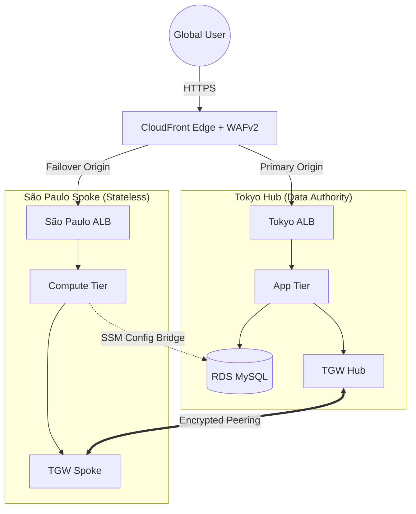

# TokyoAPPI: Multi-Region Medical Cloud Architecture


## 1. Executive Summary
**Project TokyoAPPI** is a reference implementation of a medical-grade cloud infrastructure designed to satisfy strict **Data Residency (Japan APPI)** requirements while enabling global, low-latency access.

The architecture evolves from a single-region foundation into a complex **Hub-and-Spoke topology**, enforcing a unidirectional data dependency where the Tokyo Hub acts as the immutable "Data Authority" and the São Paulo Spoke operates as a stateless compute extension.

### 📂 [View Full Audit Evidence & Chain of Custody](./DELIVERABLES/README.md)

## 2. High-Level Architecture
The system leverages **Transit Gateway Peering** to create a private, encrypted backbone between regions, ensuring Protected Health Information (PHI) never traverses the public internet during cross-region writes.



## 3. Curriculum Roadmap & Delivery Modules

This project was executed in three distinct phases, mirroring the evolution of a production environment.

### 🏛️ [Phase 1: Foundations & Identity](./LAB1/README.md)
**Objective:** Hardening the cloud perimeter and identity posture.
*   **Zero-Trust Identity:** Eliminated long-lived credentials by implementing **IAM Instance Profiles** for all compute resources.
*   **Secret Rotation:** Integrated **AWS Secrets Manager** for automated database credential rotation.
*   **Observability:** Deployed custom CloudWatch metrics ("The Panic Button") to monitor application-to-database health.

### 🛡️ [Phase 2: Edge Security & Cloaking](./LAB2/README.md)
**Objective:** Establishing a "Double-Lock" perimeter defense.
*   **Origin Cloaking:** Restricted Load Balancer ingress to the **CloudFront Managed Prefix List** (Layer 4) and enforced a custom **X-Origin-Secret** handshake (Layer 7).
*   **Edge Defense:** Deployed **AWS WAFv2** with managed rule sets (SQLi, Common Threats) to scrub traffic before it hits the VPC.
*   **Cache Strategy:** Implemented Origin-Driven Caching (`s-maxage`) to optimize content delivery while respecting data freshness.

### 🌐 [Phase 3: Multi-Region Compliance](./LAB3/README.md)
**Objective:** Enforcing Data Residency via Asymmetric Routing.
*   **The "Legal Corridor":** Established a private **Transit Gateway (TGW) Peering** connection between `ap-northeast-1` and `sa-east-1`.
*   **Stateless Enforcement:** Implemented conditional Terraform logic (`count = 0`) to physically prevent database creation in the Spoke region.
*   **The "Triple Tap":** Executed a multi-stage deployment protocol to resolve circular dependencies between TGW Peering requests, acceptances, and route propagation.

## 4. Repository Structure

```text
Project-ARMAGEDDON/
├── DELIVERABLES/           # Verified Audit Artifacts & Screenshots
│   ├── LAB1/               # IAM/Secrets JSON Proofs
│   ├── LAB2/               # WAF/Cloaking/Cache Proofs
│   └── LAB3/               # Residency/Corridor/Routing Proofs
├── LAB1/                   # Phase 1 Source Code
├── LAB2/                   # Phase 2 Source Code
├── LAB3/                   # Phase 3 Source Code (Final State)
│   ├── env/tokyo           # Hub State Configuration
│   ├── env/saopaulo        # Spoke State Configuration
│   └── modules/            # Reusable Terraform Modules
└── README.md               # Master Documentation
```

## 5. Verification Status

All compliance controls have been verified against the SEIR Foundations specifications.

| Control | Mechanism | Status |
| :--- | :--- | :--- |
| **Data Residency** | Physical Isolation of RDS to Tokyo | ✅ **CONFIRMED** |
| **Network Integrity** | Private IP routing via TGW Corridor | ✅ **CONFIRMED** |
| **Edge Security** | WAF Attached & Origin Cloaked | ✅ **CONFIRMED** |
| **Global Access** | Active-Passive Origin Failover | ✅ **CONFIRMED** |
